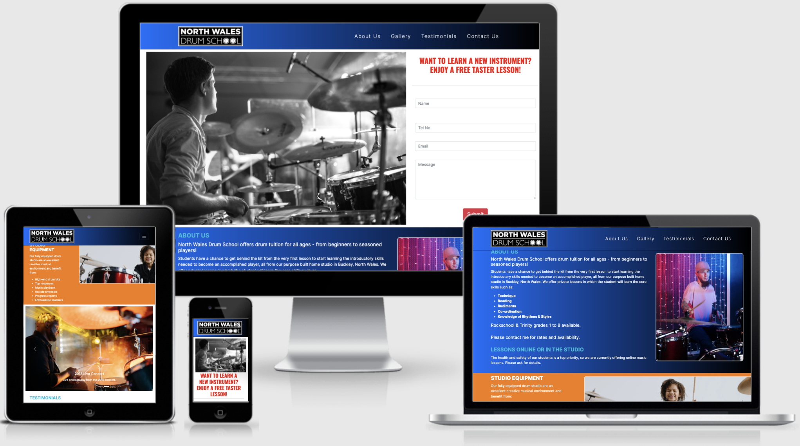
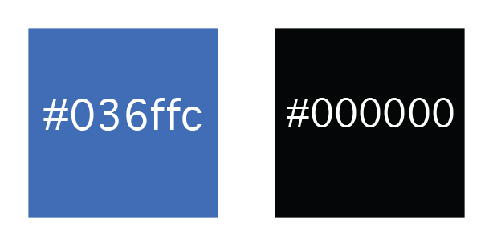

# Milestone Project 1 - North Wales Drum School.

<h2 align="center"></h2>

## Purpose

For this project I intend to design a static website for a fictional drum teacher or school. This site will be constructed using knowledge gained so far on the HTML, CSS and User Centric Design Modules.

The live website can be found here. [link](https://robappleby1.github.io/user-centric-milestone-project/)

 

# North Wales Drum School Website.

The North Wales Drum School website is a site for a fictional or hypothetical Drumming School business. This project is based on and inspired by my 8 year old daughter taking up the drums just over 1 year ago.

This site will be a fully responsive website that will advertise the School, along with being a source of information that is easy to digest and understand for consumers both young and old.

 

# User Experience Design

### First Time Visitor Goals

- As a first time user I need to easily navigate through the site and find the information that I need.
- As a first time user I need to be able to view the website clearly on both tablet and mobile, as well as desktop.
- As a first time user I need to be able to easily find contact details to book lessons and also find social media links to follow the school.
- As a first time user I need to be able to view testimonials to understand what the users think of the service provided.

### Returning Visitor Goals

- As a returning visitor I want to be able to look at the gallery to view images of concerts, and videos of performances.
- As a returning visitor I want to be able to sign up to the email newsletter to be kept up to date with any lesson changes or Gallery updates.

 

# Design

## Colour Scheme

The colours I intend to use for the site are Blue (#036ffc) and black (#000000).
The blue will represent a feeling of trust and stability and will compliment the boldness of the black well.

 

<h2 align="center"></h2>

The colours #00bee0 (light blue), #f50707 (red) and #f57a07 (orange) were added to the main colour scheme to accent the existing royal blue and black.

 

# Typography

The logo will be made up of an svg file rather than a typeface. This logo will be link to the main header.

- Inter (including all font weights)
A sans-serif font with easy readability for the paragraph text.

- A further typeface of Oswald was added to be used in the form header.

 

# Structure

The pages will contain the same fixed navigation bar at the top of the page to convey a sense of continuity. This navigation menu will allow users to move through the site easily, directing the user to a new section. The Nav bar will be collapsable on a mobile advice.

 

# Landing page layout

The main page header will consist of a large eye catching image which will grab the users attention straioght away,
showing exactly what the site is about. 
 
There will be an added form on the landing page which the visitor to the site will immediately see, which will offer a free taster lesson. This will be followed by an about us section, which will consist of details about the drum school plus a section with technical details about the percussion instruments in the studio.
 
There will be a testimonial section, giving reviews of past and current users of the school. 
 
There will also be a gallery section which will show pictures of the studio, plus some live pictures and video of recent
concerts put on by the studio. Lastly, there will be the footer section which will consist of the contact details and the social media icons.

 

# Wireframes

Desktop view [here](/assets/images/desktop-view.png)

Tablet view [here](/assets/images/tablet-view.png)

Mobile view [here](/assets/images/mobile-view.png)

 

# Technologies used

- HTML5
- CSS3

 

# Frameworks and Libraries

- Bootstrap v5.1.3: Bootstrap was used to assist with the responsiveness and styling of the website. 
- Google Fonts: Google fonts were used to import the Pacifico and Quicksand font family into the style.css file which is used on all pages throughout the project. 
- Gitpod: Git was used for version control by utilizing the Gitpod terminal to commit to Git and Push to GitHub. 
- GitHub: GitHub is used to store the project's code after being pushed from Git. 
- Photoshop: Photoshop was used to resizing images and editing photos for the website. 
- Balsamiq: Balsamiq was used to create the wireframes during the design process. 
- Chrome dev tools was used to view the site on different devices.

 

# Deployment

## Forking the GitHub Repository
By forking the GitHub Repository we make a copy of the original repository on our GitHub account to view and/or make changes without affecting the original repository by using the following steps...

Log in to GitHub and locate the GitHub Repository.
At the top of the Repository (not top of page) just above the "Settings" Button on the menu, locate the "Fork" Button.
You should now have a copy of the original repository in your GitHub account.
 
## Local Deployment
Log in to GitHub and locate the GitHub Repository.
Under the repository name, click "Clone or download".
To clone the repository using HTTPS, under "Clone with HTTPS", copy the link.
Open Git Bash.
Change the current working directory to the location where you want the cloned directory to be made.
Type git clone, and then paste the URL you copied.
 
## Remote Deployment
1. Log in to GitHub and locate the [GitHub Repository](https://github.com/).
2. At the top of the Repository locate the "Settings".
3. Click on "Pages" will open "GitHub Pages" Section.
4. Under "Source", click the dropdown called "None" and select "Main Branch".
5. The page will automatically refresh.
6. At the top near github header to locate the now published site [link](https://robappleby1.github.io/user-centric-milestone-project/)

 

# Testing
The Lighthouse, W3C Markup Validator and the Lighthose report were used to determine whether there were any
errors in the code.

- [W3C Markup Validator](assets/images/html-verification.png)
- [W3C CSS Validator](assets/images/css-validator.png)
- [Lighthouse report](assets/images/lighthouse.png)

## Testing User Stories from UX Section

- As a first time user I need to easily navigate through the site and find the information that I need.
    - When accessing the site, users see the main header image which immediately grabs the attention.
    - Easily readable fixed navigation page allows users to navigate up and down the page easily.
    - The sections have been designed to be easily readable, with each section identifiable with colour breaks.

 

- As a first time user I need to be able to view the website clearly on both tablet and mobile, as well as desktop.
    - The website was built from a mobile-first design perspective, giving a clear indication of the important      information the end user needs.

 

- As a first time user I need to be able to easily find contact details to book lessons and also find social media links to follow the school.
    - Upon entering the site the booking form to access the ability to book a free taster lesson is immediately to the right or underneath the header form, so this is easy to access. The fixed navigation bar at the top gives easy access to the contact details at the foot of the website.

     

- As a first time user I need to be able to view testimonials to understand what the users think of the service provided.
     - The testimonials section is easily accessed via the fixed navigation bar.
 

# Further Testing

- The Website was tested on Chrome, Firefox and Safari browsers.
- The site was tested to make sure all links worked properly.
- The website was viewed on a variety of devices such as Desktop, Laptop, Tablet, iphone SE, iphone X, iphone 7.
- Friends and family members were asked to review the site and documentation to point out any bugs and/or user experience issues.

 

# Credits
## The following images were used in the project:
 

- The header image was taken by user 4634656 on pixabay.com [link](https://pixabay.com/photos/drums-drummer-floor-sticks-pool-2089829/)
 

- The 2nd image was taken by user Tima Miroschnichenko on Pexels.com [link](https://www.pexels.com/photo/man-playing-drum-set-5045874/)
 

- The 3rd image was taken by user cottonbro on Pexels.com [link](https://www.pexels.com/photo/girl-having-fun-playing-bass-drum-9644679/)

 

- The carousel images are as follows:
 

- Image 1: Taken by Genaro Servin on Pexels.com [link](https://www.pexels.com/photo/man-playing-drum-inside-mall-804552/)
 

- Image 2: Taken by Yan Krukov on Pexels.com [link](https://www.pexels.com/photo/man-in-black-shirt-playing-drums-beside-yellow-light-9009601/)
 

- Image 3: Taken by jackmac34 on Pixabay.com [link](https://pixabay.com/photos/music-drums-instruments-musician-1378224/)

 

# Credits

- Bootstrap Library used in project mainly to make site responsive
- Inter and Oswald fonts supplied by Google Fonts
- Social media icons by Fontawesome
- Images used in readme were screen shot from W3 Validators and Am I Responsive

 

# Acknowledgements

My Mentor Chris Quinn for continuous helpful feedback.

Slack community for helpful advice.